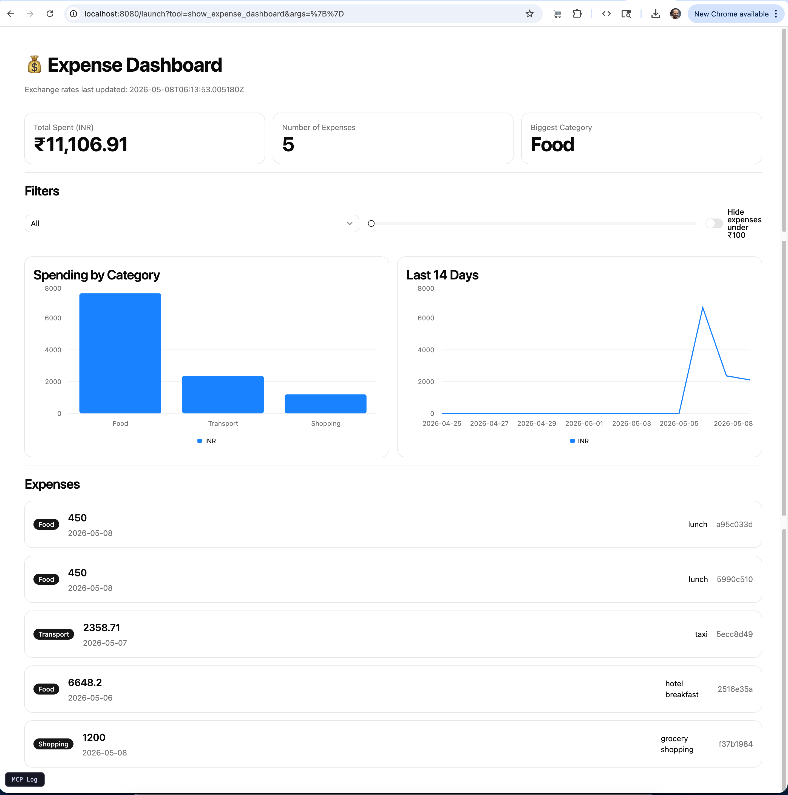

# 💰 Expense Tracker — MCP Server with Prefab UI + Custom Agent Client

A project that demonstrates the full **Model Context Protocol (MCP)** stack in Python: a FastMCP server with three tools (internet, local CRUD, Prefab UI dashboard) and a custom agent client built on Gemini that orchestrates the tools through a manual ReAct-style loop.



---

## ✨ What this project shows

- ✅ **An MCP server with 3 tools** that talk to the internet, manipulate a local file, and render an interactive UI
- ✅ **A reactive Prefab UI dashboard** with live filters (slider, dropdown, switch), bar/line charts, and a `ForEach` list
- ✅ **A custom agent client** (no framework) that connects to the server over stdio, asks Gemini what to do, parses the response, calls the chosen tool, and feeds results back — until the task is solved
- ✅ **A single forcing prompt** that requires the agent to use all three tools in sequence

---

## 🧩 Architecture

```
                         ┌──────────────────────────────┐
                         │  expense_tracker_client.py   │
                         │  (manual ReAct agent loop)   │
                         │                              │
   user types prompt ──► │  1. send prompt to Gemini    │
                         │  2. parse FUNCTION_CALL line │
                         │  3. call MCP tool            │
                         │  4. feed result back         │
                         │  5. repeat until FINAL_ANSWER│
                         └──────────────┬───────────────┘
                                        │ MCP over stdio
                                        ▼
                         ┌──────────────────────────────┐
                         │   expense_mcp_server.py      │
                         │   (FastMCP server)           │
                         │                              │
                         │   ┌───────────────────────┐  │
                         │   │ fetch_exchange_rates  │──┼──► open.er-api.com
                         │   │ expense_crud          │──┼──► expenses.json
                         │   │ show_expense_dashboard│──┼──► Prefab UI
                         │   └───────────────────────┘  │
                         └──────────────────────────────┘
```

The Prefab UI dashboard is rendered via `fastmcp dev apps` — a separate browser window where you can interact with the live, reactive components.

---

## 🛠 The three tools

### 1. `fetch_exchange_rates()` — Internet

Hits [open.er-api.com](https://open.er-api.com) (free, no API key) to pull live currency rates with INR as the base. Caches the rates into `expenses.json` so the dashboard can convert all amounts to INR.

### 2. `expense_crud(action, ...)` — Local file CRUD

Standard CRUD on `expenses.json`. Actions: `create`, `read`, `update`, `delete`.

| Action   | Required args                          | Behavior                            |
| -------- | -------------------------------------- | ----------------------------------- |
| `create` | `amount`, `currency`, `category`       | Adds an expense with a generated ID |
| `read`   | —                                      | Returns the full list               |
| `update` | `expense_id`, plus any field to change | Patches an existing expense         |
| `delete` | `expense_id`                           | Removes by ID                       |

- **Categories**: `Food`, `Transport`, `Shopping`, `Bills`, `Entertainment`, `Other`
- **Currencies**: `INR`, `USD`, `EUR`, `GBP`, `JPY`, `AUD`, `CAD`, `SGD`

### 3. `show_expense_dashboard()` — Prefab UI

Returns a `PrefabApp` with reactive client-side state. The dashboard includes:

- **Summary cards** — total spent (INR), expense count, biggest category
- **Reactive filters** (no server round-trip):
  - Category dropdown (`Select`)
  - Minimum amount slider (`Slider`)
  - "Hide expenses under ₹100" toggle (`Switch`)
- **Charts** — `BarChart` of spending by category, `LineChart` of last 14 days
- **Expense list** — `ForEach` over expenses, each card filtered live by the controls above

---

## 📦 Project files

| File                        | Purpose                                          |
| --------------------------- | ------------------------------------------------ |
| `expense_mcp_server.py`     | FastMCP server with the three tools              |
| `expense_tracker_client.py` | Custom agent client (Gemini + manual ReAct loop) |
| `expenses.json`             | Local CRUD storage. Auto-created if missing.     |
| `requirements.txt`          | Dependencies                                     |
| `.env`                      | Holds `GEMINI_API_KEY` (you create this)         |

---

## 🚀 Setup

### 1. Clone and install

```bash
python -m venv .venv
source .venv/bin/activate            # Windows: .venv\Scripts\activate
pip install -r requirements.txt
```

### 2. Get a Gemini API key

Create a free key at [aistudio.google.com](https://aistudio.google.com/app/apikey), then create a `.env` file in the project root:

```
GEMINI_API_KEY=your_key_here
```

---

## ▶️ Running the project

You'll typically run **two terminals side by side**: one for the agent client, one for the Prefab UI dashboard.

### Terminal 1 — agent client (interactive prompts)

```bash
python expense_tracker_client.py
```

Once connected, you'll be prompted:

```
💬 Expense Tracker Agent — type 'quit' to exit

>
```

Type any natural-language task and press Enter. The agent will print each iteration as it picks tools and observes results, ending with `FINAL_ANSWER`.

### Terminal 2 — Prefab UI dashboard

```bash
fastmcp dev apps expense_mcp_server.py
```

This opens a browser-based playground. Click **`show_expense_dashboard`** → **Run** to see the reactive UI. Drag the slider, change the category dropdown, and toggle the "hide small" switch — everything filters live with no server calls.

> **GitHub Codespaces note:** when running in Codespaces, the playground binds to a local port. Open the **Ports** tab in VS Code, find the new port, and click the 🌐 globe icon to open it in your browser. If the URL is blocked, right-click the port → **Port Visibility → Public**.

---

## 🎯 The forcing prompt (demo prompt for graders)

Paste this into the agent client when prompted:

> _"I just got back from a trip. Add these expenses: ₹450 lunch today (Food), $25 taxi yesterday (Transport), €60 hotel breakfast 2 days ago (Food), and ₹1200 grocery shopping today (Shopping). Then refresh the exchange rates and open my expense dashboard."_

This forces the agent to use all three tools:

- `expense_crud(action=create, ...)` × 4 → **CRUD**
- `fetch_exchange_rates()` → **Internet**
- `show_expense_dashboard()` → **UI**

After the agent completes, switch to the dashboard tab in your browser, hit **Run** on `show_expense_dashboard`, and demonstrate the live reactive filters.

---

## 🤖 How the agent client works

The client is a **manual ReAct loop**, not a framework call. This keeps the magic visible:

1. **Connect** to the MCP server via `stdio_client` and list available tools.
2. **Build a system prompt** that lists the tools and tells Gemini to respond with exactly one line per turn:
   ```
   FUNCTION_CALL: tool_name|key1=value1|key2=value2|...
   FINAL_ANSWER: <summary>
   ```
3. **Loop** for up to `MAX_ITERATIONS` rounds:
   - Send the system prompt + task + history of prior steps to Gemini
   - Parse the response line into either a tool call or a final answer
   - Execute the tool via `session.call_tool(name, args)`
   - Append the result to history; repeat
4. **Exit** on `FINAL_ANSWER` or when the iteration cap is hit.

The `key=value` argument format means the agent doesn't have to remember positional argument order — it just names the args it cares about and skips the rest.

---

## 🧪 Example trace

```
--- Iteration 1 ---
LLM: FUNCTION_CALL: expense_crud|action=create|amount=450|currency=INR|category=Food|date=2026-05-06|note=lunch
→ expense_crud({'action': 'create', 'amount': 450, 'currency': 'INR', ...})
← {"ok":true,"created":{"id":"a1b2c3d4",...},"total_count":1}

--- Iteration 2 ---
LLM: FUNCTION_CALL: expense_crud|action=create|amount=25|currency=USD|category=Transport|date=2026-05-05|note=taxi
→ expense_crud({'action': 'create', 'amount': 25, 'currency': 'USD', ...})
← {"ok":true,"created":{"id":"e5f6g7h8",...},"total_count":2}

... (more creates) ...

--- Iteration 5 ---
LLM: FUNCTION_CALL: fetch_exchange_rates
→ fetch_exchange_rates({})
← {"ok":true,"base":"INR","rates":{...},"updated_at":"..."}

--- Iteration 6 ---
LLM: FUNCTION_CALL: show_expense_dashboard
→ show_expense_dashboard({})
← Expense dashboard rendered. 4 expenses, total ₹13,376.44 (INR equivalent). Biggest category: Food. Rates current.

--- Iteration 7 ---
LLM: FINAL_ANSWER: Added 4 trip expenses, refreshed exchange rates, and opened the dashboard.
```

---

## 🧹 Resetting for a fresh demo

```bash
rm expenses.json
```

The server auto-creates a fresh empty file on the next call.

---

## ⚠️ Notes & limitations

- **Prefab UI doesn't render in stdio mode.** When the agent client calls `show_expense_dashboard`, it only sees the text fallback summary. The full reactive UI is only visible via `fastmcp dev apps`. This is by design — Prefab needs a host that knows how to render component trees, and stdio MCP clients don't.
- **The Gemini model name is hardcoded** at the top of `expense_tracker_client.py`. If the model is deprecated or renamed, swap the constant.
- **Notes containing `|` or `=` will break the parser.** The system prompt instructs Gemini to use dashes instead. For a real product you'd add escaping; for a class demo this is fine.
- **`MAX_ITERATIONS = 10`** is enough for the forcing prompt (4 creates + fetch + dashboard + final = 7 turns) with headroom for retries. Bump it for longer tasks.

---

## 🎓 Assignment requirements coverage

| Requirement                      | Where it lives                                 |
| -------------------------------- | ---------------------------------------------- |
| MCP server with 3 functions      | `expense_mcp_server.py`                        |
| Internet (fetch data)            | `fetch_exchange_rates`                         |
| CRUD on local file               | `expense_crud` on `expenses.json`              |
| UI built with Prefab             | `show_expense_dashboard` (reactive Prefab app) |
| Single prompt forces all 3 tools | The forcing prompt above                       |
| Run UI in a web/desktop app      | `fastmcp dev apps` (web)                       |

---

Built with [FastMCP](https://gofastmcp.com), [Prefab UI](https://gofastmcp.com/apps/prefab), and [Gemini](https://aistudio.google.com).
